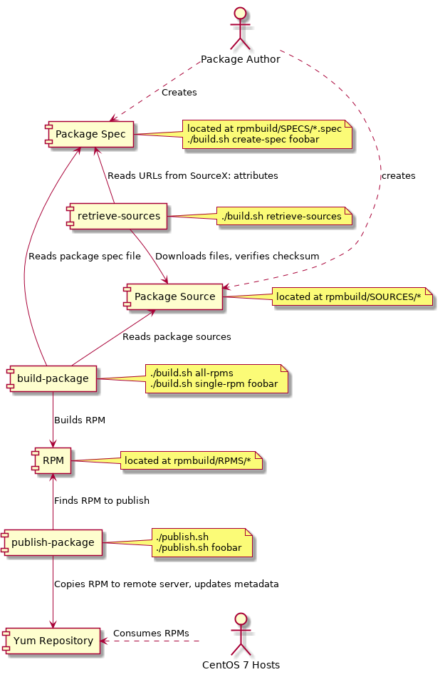

# Docker RPM buildchain

This repository contains spec files, sources, and a Bash/Docker-based buildchain
to create and publish RPM packages.

# How RPMs are built, distributed and consumed

The buildchain allows to retrieve and validate upstream sources, author RPM
packages, build RPM packages, and publish RPM packages to remote yum
repositories.

All RPM commands are run in isolation via docker.

# Prerequisites

Docker and Bash.

# Installation

clone this repository with git.

# Usage

## Create new RPM package

This repository stores package definitions (`.spec` file) and sources (URLs with
tar.gz files, service units, config files, etc.)  To create a new spec file and
source directory for the package `foobar`, run

    $ ./build.sh create-spec foobar

The spec file will be created at `rpmbuild/SPECS/foobar.spec`, together with its
source folder at `rpmbuild/SOURCES/foobar`.

Spec files define URLs where the upstream source(s) can be found.  To prevent
malicious code from entering the system, downloaded sources are first
verified.   When adding URL sources, a `.sha256`-suffixed file must be placed in
the package's source directory containing the sha256sum of the file.  The file
must be readable by `sha256sum -c`.

Also, downloaded sources must never be comitted to VCS (and a .gitignore file
must be added to each `SOURCES` folder to prevent this).

**TODO**: use custom template with sourcedir/%{name} set

## Download and verify sources for a package

Before a RPM can be built, its sources must be downloaded and placed in the
package's source directory.

To retrieve the sources for the package `foobar`, run

    $ ./build.sh retrieve-sources foobar

To retrieve all sources, run

    $ ./build.sh retrieve-sources

After download, source files are automatically verified.

Once downloaded, sources will not be re-downloaded.  To force re-download
sources for the `foobar` package, clean them first:

    $ ./clean.sh source foobar

This will only remove files that are placed in the package's source directory
`.gitignore` file.

## Build package

To build an RPM for the `foobar` package, run

    $ ./build.sh single-rpm foobar

To build all RPMs, run

    $ ./build.sh all-rpms

# Publish packages

After an RPM is built it can be made available to other hosts.  Each environment
should therefore include a yum repository server where RPMs can be published and
consumed by other hosts.

The buildchain supports password-less publishing to a yum repository server via
SSH.  For this to work, a SSH key must be configured for the repository-owning
user, usually `yumrepo`, on the repository server.  The publishing path on the
remote server can be set with the `TARGET_DIRECTORY` environment variable and
defaults to `/var/db/yum/centos/7/x86_64`.

To publish the `foobar` package in the `dev1` environment, run

    $ TARGET_HOST=yum01.dev1.example.org ./publish.sh foobar

To publish all local packages in the `dev1` environment, run

    $ TARGET_HOST=yum01.dev1.example.org ./publish.sh

The default connecting user is `yumrepo`.  To use a different username, run

    $ TARGET_HOST=yum01.dev1.example.org TARGET_USER=repopublish ./publish.sh

## Kill it with fire

To remove downloaded sources from all packages:

    ./clean.sh sources

To remove downloaded sources from the `foobar` package:

    ./clean.sh source foobar

To remove RPMs:

    ./clean.sh rpms

Remove everything:

    ./clean.sh all

## Using another build image

By default, the `centos7-rpmbuild` docker image in the `docker/` subfolder is
used to execute all rpm commands.  To use a different image in the `build.sh`
script, pass a custom `IMAGE` variable:

    IMAGE=centos7-rpmcustom ./build.sh

## Update existing package

**TODO:** Describe how to upgrade existing package which may already be
installed somewhere without making people angry.
