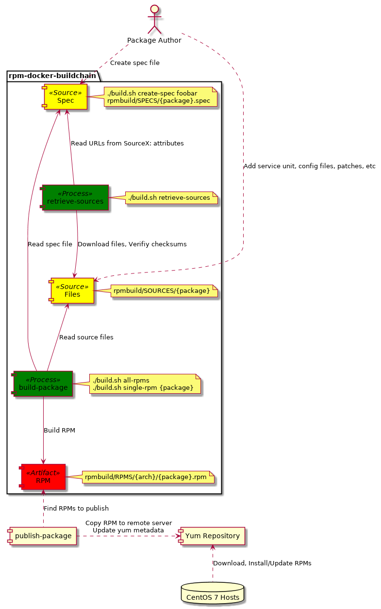

# Docker RPM buildchain

This repository contains spec files, sources, and a Bash/Docker-based buildchain
to create and publish RPM packages.  The buildchain helps with retrieval and
validation of upstream sources, creating new RPM spec files from templates, and
to build RPM packages in isolated docker containers.

# Prerequisites

Docker and Bash.

# Usage

You should manage spec files under version control.  Either Copy the `build.sh`
file and the `rpmbuild` folder to a separate git repository, or if you are e.g.
deploying applications, in the same repo as the application.

## Create new RPM package

The `rpmbuild` directory contains package definitions (`.spec` file) and sources
(URLs with tar.gz files, service units, config files, etc.)  To create a new
spec file and source directory for the package `foobar`, run

    $ ./build.sh create-spec foobar

The spec file will be created at `rpmbuild/SPECS/foobar.spec`, together with its
source folder at `rpmbuild/SOURCES/foobar`.

Spec files define URLs where the upstream source(s) can be found.  To prevent
malicious code from entering the system, downloaded sources are first
verified.   When adding URL sources, a `.sha256`-suffixed file must be placed in
the package's source directory containing the sha256sum of the file.  The file
must be readable by `sha256sum -c`.

Also, downloaded sources must never be comitted to VCS (and a .gitignore file
must be added to each `SOURCES` folder to prevent this).

**TODO**: use custom template with sourcedir/%{name} set

## Download and verify sources for a package

Before a RPM can be built, its sources must be downloaded and placed in the
package's source directory.

To retrieve the sources for the package `foobar`, run

    $ ./build.sh retrieve-sources foobar

To retrieve all sources, run

    $ ./build.sh retrieve-sources

After download, source files are automatically verified.

Once downloaded, sources will not be re-downloaded.  To force re-download
sources for the `foobar` package, clean them first:

    $ ./clean.sh source foobar

This will only remove files that are placed in the package's source directory
`.gitignore` file.

## Build package

To build an RPM for the `foobar` package, run

    $ ./build.sh single-rpm foobar

To build all RPMs, run

    $ ./build.sh all-rpms

## Kill it with fire

To remove downloaded sources from all packages:

    ./clean.sh sources

To remove downloaded sources from the `foobar` package:

    ./clean.sh source foobar

To remove RPMs:

    ./clean.sh rpms

Remove everything:

    ./clean.sh all

## Using another build image

By default, rpm commands run in the `msteinhoff/rpm-docker-buildchain:latest`
docker image.  To use a different image, pass a custom `IMAGE` variable:

    IMAGE=centos7-rpmcustom ./build.sh

# Credits

This repo was inspired by Alan Franzoni's [fpm-within-docker][1].

[1]: https://github.com/alanfranz/fpm-within-docker
